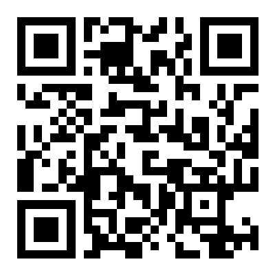

# TwentyOne.Life

Tools for running your own Bitcoin infrastructure, with a focus on **Bitcoin Blake2b (BitcoinB2B)**,
the RDTS hardfork whose proof of work is BLAKE2b.

Everything here is GPLv3, self-hostable, and built to run on hardware you control. No telemetry, no
hosted service in the middle, no account required.

More at [twentyone.life](https://twentyone.life).

## Projects

| | |
|---|---|
| [**Shulcrum**](https://github.com/TwentyOneLife/Shulcrum) | An Electrum server that indexes and serves chains with 164 byte block headers and BLAKE2b proof of work. A fork of Fulcrum. |
| [**shulcrum-startos**](https://github.com/TwentyOneLife/shulcrum-startos) | Shulcrum packaged as a StartOS `.s9pk`, so it installs on a StartOS server beside your node. |
| [**mempool-bip110**](https://github.com/TwentyOneLife/mempool-bip110) | A mempool explorer with BIP110 "Reduced Data" violation detection and an IPv4, IPv6 and Tor node chart. |

### Where things stand

Shulcrum's BLAKE2b support is verified on testnet upstream. Verifying it against mainnet, by indexing
the live chain and validating headers and address history against a node, is work in progress rather
than a finished claim. The StartOS package builds, signs and installs, and has not yet served a
wallet end to end.

Said plainly because "it compiles and syncs testnet" is not evidence about the chain people keep
money on.

## Supporting this work

Donations in **BitcoinB2B**:

```
1BH665bXvEqSuoWQUihiQiPpt2BqpzrgGD
```

As a URI, which a wallet with a handler opens on a click, and which is what the QR encodes:

```
bitcoin:1BH665bXvEqSuoWQUihiQiPpt2BqpzrgGD
```



**Read this before sending.** Bitcoin Blake2b shares Bitcoin's address format and its genesis block,
so the address above is a perfectly valid Bitcoin address as well, and nothing about it says which
chain it belongs to. Send from a Bitcoin Blake2b wallet. Bitcoin sent to it is a different asset and
is not a donation to this project, whatever your wallet shows you.

There is no way to make that distinction visible in the address itself. It is a property of the fork,
not an oversight.
